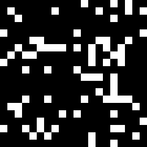

# Game of Life
This library is my attempt at implementing Conway's Game of Life in Rust. My goal was to optimize and overengineer it in order to learn Rust along the way.



Conway's Game of Life plays in a grid containing cell that are either dead or alive. Then, the next generation is calculated with the prior time step following rule:
1. If a cell was dead, it will be revived if it had exactly three living neighbors.
2. If a cell was alive, it will stay alive if it had two or three neighbors. If that's not the case, it will die of loneliness or overpopulation.

## Usage
You can compile the program with `cargo build --release`. The binary then takes the following syntax:  
```gameoflife -{flags} {gif|tui}```  
with the flags being one of
- `-a`: algorithm (std or conv)
- `-i`: number of iterations
- `-x`: number of columns
- `-y`: number of rows
- `-p`: probability of a cell being alive in the initial field
- `-h`: list all commands  

`gif` saves the Game of Life as a GIF with [`plotters`](https://docs.rs/plotters/latest/plotters/),  
`tui` plots the Game of Life in the terminal with [`termion`](https://crates.io/crates/termion)

## Algorithms
The standard algorithms iterates over every cell, counts its neighbors, and then decides whether it's alive in the next step via normal `if` statements. This is fairly quick, especially as I used [`rayon`](https://crates.io/crates/rayon) to do this with multiple threads.  
The convolution algorithm, however, is about 17x faster. It uses [`ndarray-ndimage`](https://crates.io/crates/ndarray-ndimage) to convolve the field with the kernel `[[1, 1, 1], [1, 0, 1], [1, 1, 1]]`, which is somehow extremely fast with only one thread (props to Nil!) and then calculates the next field with only addition, multiplication, and equality comparisons.

## Licenses
Thanks to all authors for their great codes. The code to drawing the Game of Life in the terminal was inspired by minesweeper in [`termion`](https://crates.io/crates/termion).

| Crate                                                         | Author(s)                                                    | License        |
| ------------------------------------------------------------- | ------------------------------------------------------------ | -------------- |
| [`clap`](https://crates.io/crates/clap)                       | rust-cli, clap-rs, Kevin K.                                  | MIT/Apache-2.0 |
| [`criterion`](https://crates.io/crates/criterion)             | rust-bus, Brook Heisler                                      | MIT/Apache-2.0 |
| [`exitcode`](https://crates.io/crates/exitcode)               | Ben Wilber                                                   | Apache-2.0     |
| [`indicatif`](https://crates.io/crates/indicatif)             | Armin Ronacher, Dirkjan Ochtman                              | MIT            |
| [`inquire`](https://crates.io/crates/inquire)                 | Mikael Mello                                                 | MIT            |
| [`ndarray`](https://crates.io/crates/ndarray)                 | bluss, Jim Turner                                            | MIT/Apache-2.0 |
| [`ndarray-ndimage`](https://crates.io/crates/ndarray-ndimage) | Nil Goyette                                                  | MIT/Apache-2.0 |
| [`plotters`](https://crates.io/crates/plotters)               | Hao Hou                                                      | MIT            |
| [`rand`](https://crates.io/crates/rand)                       | rust-lang-nursery, rust-random, Alex Crichton, Diggory Hardy | MIT/Apache-2.0 |
| [`rayon`](https://crates.io/crates/rayon)                     | Josh Stone, Niko Matsakis                                    | MIT/Apache-2.0 |
| [`termion`](https://crates.io/crates/termion)                 | Jeremy Soller, Michael Murphy, ticki                         | MIT            |